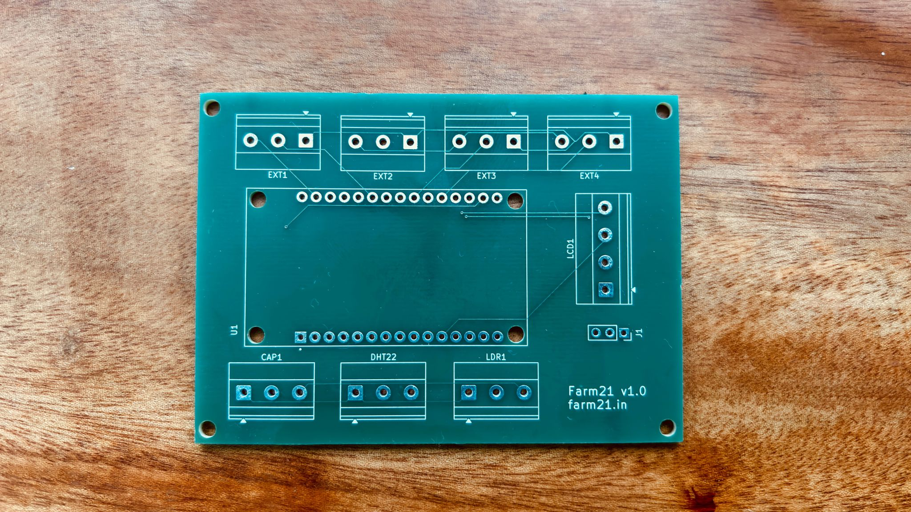
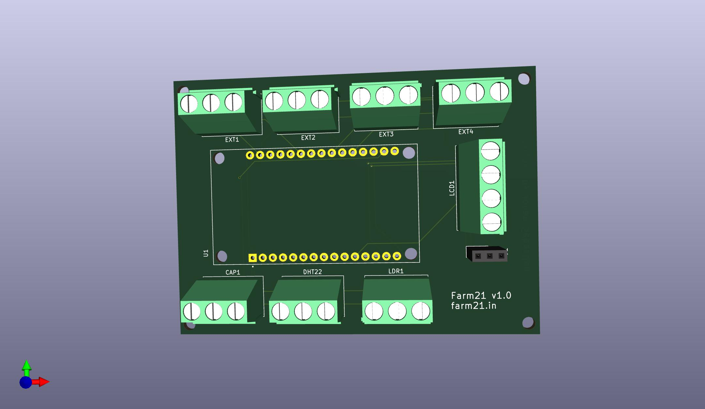
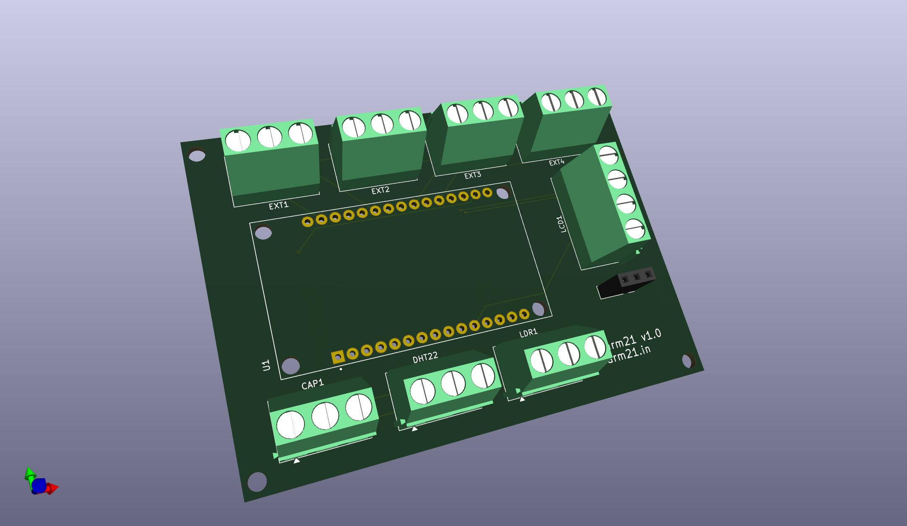
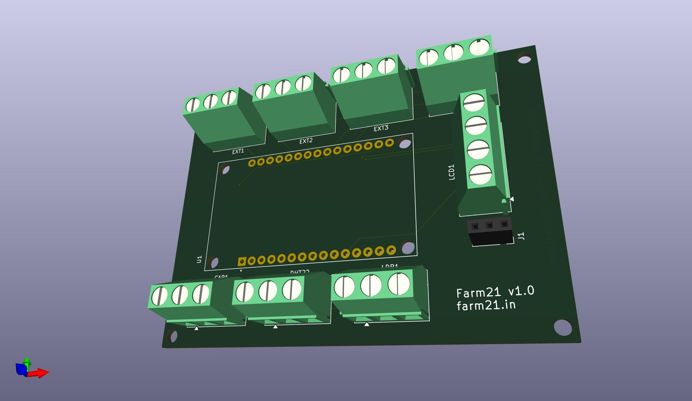
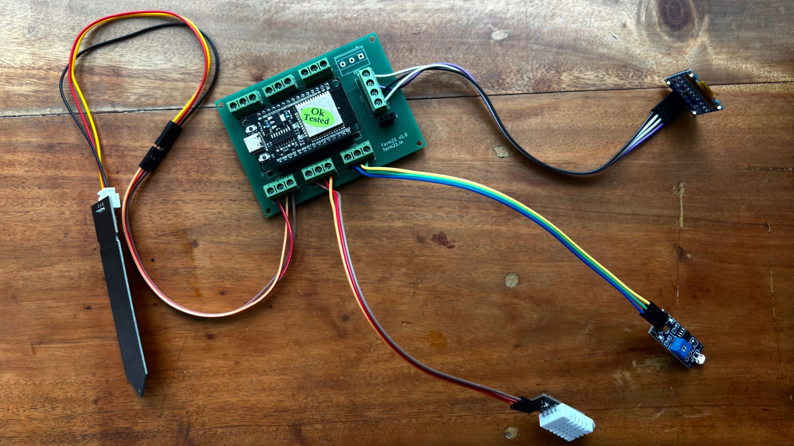

# Farm21 ESP32 Shield v1

**Open-source hardware + firmware for smart farming automation**



## Introduction
A custom ESP32 expansion shield built for **Farm21**.
This board integrates environmental sensors, relays, power management, and an OLED display. It is designed for reliability in an end-to-end IoT platform for real-world farm conditions.




## Features

* **Plug-and-Play ESP32 Compatibility**
* **Sensor Interfaces**
  * Soil moisture
  * DHT22 temp/humidity
  * LDR (light intensity)
  * Future expansion slots
* **Actuator Outputs**

  * 2–4 channel relay support
* **0.96" OLED Display** (I²C)
* **Robust Power Regulation**

  * 5V → 3.3V LDO
  * Noise filtering + protection
* **Modular Screw-Terminal Inputs**
* **Designed in KiCad** (BOM + Gerbers included)

---



## Hardware Overview

The shield is designed to integrate seamlessly into the Farm21 ecosystem.

### Sensor Support

* **Soil Moisture Probe** (Analog Input)
* **DHT22** (Digital Input)
* **LDR** (Voltage Divider → Analog Input)

### Display

* **I²C OLED** for real-time data cycling or debug logs.

### Power

* Supports **5V external input**
* Onboard **3.3V regulation** for ESP32 and sensors
* Capacitive filtering to reduce noise from pumps/relays



## Firmware (Example)

```cpp
#include <Wire.h>
#include <Adafruit_GFX.h>
#include <Adafruit_SSD1306.h>
#include <DHT.h>

// -----------------------------
// Pin Configuration
// -----------------------------
#define DHTPIN 4          // DHT22 signal pin
#define DHTTYPE DHT22

#define SOIL_PIN 34       // Capacitive soil moisture sensor (Analog)
#define LDR_PIN 35        // LDR (Analog)

#define SCREEN_WIDTH 128
#define SCREEN_HEIGHT 64

Adafruit_SSD1306 display(SCREEN_WIDTH, SCREEN_HEIGHT, &Wire, -1);
DHT dht(DHTPIN, DHTTYPE);

// -----------------------------
// Setup
// -----------------------------
void setup() {
  Serial.begin(115200);
  dht.begin();

  // OLED Init
  if (!display.begin(SSD1306_SWITCHCAPVCC, 0x3C)) {
    Serial.println("SSD1306 allocation failed");
    for (;;);
  }
  display.clearDisplay();
  display.setTextColor(SSD1306_WHITE);
  display.setTextSize(1);
  display.setCursor(0,0);
  display.println("Farm21 Booting...");
  display.display();
  delay(1500);
}

// -----------------------------
// Main Loop
// -----------------------------
void loop() {
  // Read DHT22
  float temp = dht.readTemperature();
  float humidity = dht.readHumidity();

  // Read soil moisture & LDR
  int soilRaw = analogRead(SOIL_PIN);
  int ldrRaw = analogRead(LDR_PIN);

  // Map values for readability (optional)
  int soilPercent = map(soilRaw, 4095, 1200, 0, 100);  // adjust based on calibration
  soilPercent = constrain(soilPercent, 0, 100);

  int lightPercent = map(ldrRaw, 0, 4095, 0, 100);
  lightPercent = constrain(lightPercent, 0, 100);

  // -----------------------------
  // Display: Temperature & Humidity
  // -----------------------------
  display.clearDisplay();
  display.setCursor(0,0);
  display.setTextSize(2);
  display.println("Temp");
  display.setTextSize(3);
  display.print(temp, 1); display.println("C");
  
  display.setTextSize(2);
  display.println();
  display.print("Hum ");
  display.print(humidity, 1); display.println("%");

  display.display();
  delay(2500);

  // -----------------------------
  // Display: Soil Moisture
  // -----------------------------
  display.clearDisplay();
  display.setCursor(0,0);
  display.setTextSize(2);
  display.println("Soil");
  
  display.setTextSize(3);
  display.print(soilPercent);
  display.println("%");

  display.display();
  delay(2500);

  // -----------------------------
  // Display: Light Level
  // -----------------------------
  display.clearDisplay();
  display.setCursor(0,0);
  display.setTextSize(2);
  display.println("Light");
  
  display.setTextSize(3);
  display.print(lightPercent);
  display.println("%");

  display.display();
  delay(2500);
}

```
---



## Future Improvements

This project is open source under the **MIT License**.
Feel free to modify, manufacture, and integrate with your own projects!


## License

This project is open source under the **MIT License**.
Feel free to modify, manufacture, and integrate with your own projects!
